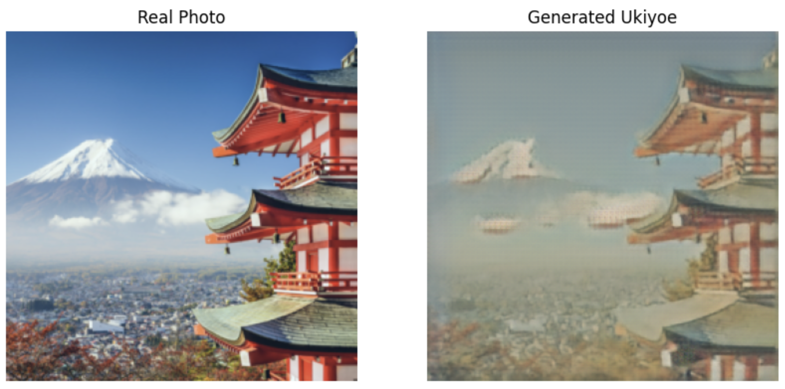

# Ukiyo-e GAN Stylet Transfer Implementation (CycleGAN)

 
This project aims to convert Real-life pictures to Ukiyoe Paintings. Though a CycleGAN is being used, the model focuses on the unidirectional transformation rather than bidirectional.

 ## Generator Parameters
 Can be accessed by using the following drive link: https://drive.google.com/file/d/1-7VujX5aaW0yVDZUoyQEv4g-hQ03tCcI/view?usp=share_link
 
 ## Note while viewing ipynb file
 In the ipynb file, the warnings that show up during the display of samples can be ignored.
 
